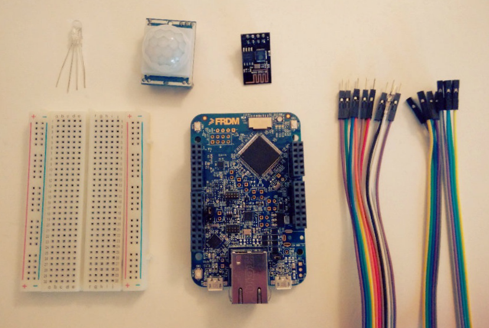

# Building an internet connected lighting system

Lights? Cool. Lights that react to motion? Also pretty cool. RGB lights that react to motion? Even cooler. Internet connected RGB lights that react to motion? Very, very cool! Let's build some!

In this tutorial we'll use the ARM mbed IoT Device Platform to build a complete connected lighting system that you can deploy in your house or office. The system consists of one (or more) extra-bright RGB LEDs hooked up to an mbed OS development board. The lights can be turned on or off by a motion sensor, but are also connected to the internet, so you can change their color. The system uses mbed Cloud to connect to the internet, and is secured end-to-end.

We'll go over all the steps required to build the hardware, the cloud integration, and the application. At the end of the tutorial you'll have a firm understanding of building complete connected IoT solutions on the mbed IoT Device Platform. You'll also have a cool light.

## Requirements

We need the following hardware:

* A [development board](https://developer.mbed.org/platforms/?software=16) capable of running mbed OS.
* A way of connecting to the internet, either:
    * Via Ethernet, by using a development board with an Ethernet connection.
    * Via WiFi, by using an [ESP8266 WiFi module](https://developer.mbed.org/teams/ESP8266/).
    * Via 6LoWPAN, by using a [6LoWPAN gateway](https://firefly-iot.com/product/firefly-6lowpan-gateway-2-4ghz/) and a [6LoWPAN shield](https://firefly-iot.com/product/firefly-arduino-shield-2-4ghz/).
* A breadboard, to hook up all components.
* A PIR sensor to detect motion.
* An RGB LED - preferably an extra-bright one. After building the original application, you can easily swap out the LED for something [fancier](https://www.adafruit.com/product/1138).
* Some jumper wires. Both male-male and male-female.
* Resistors: 1x 100 Ohm, 2x 220 Ohm.

*Components required to build our lighting system. On the top: RGB LED, PIR sensor, ESP8266 WiFi module. On the bottom: breadboard, NXP FRDM-K64F, jumper wires.*

We also need an account on [developer.mbed.org](http://developer.mbed.org/), to access the online compiler and mbed Cloud.
