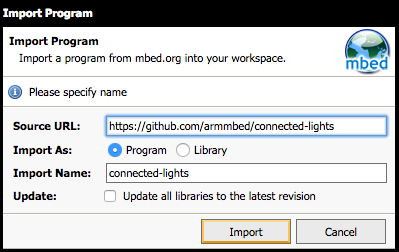
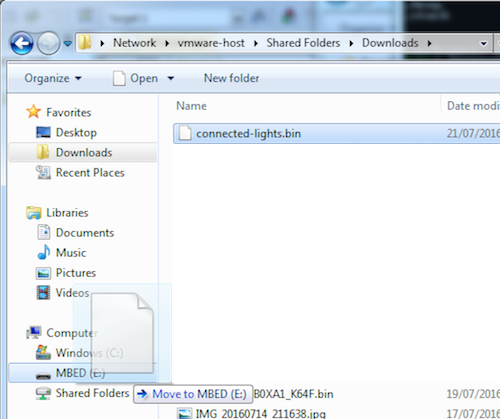

# Writing the software

Now we can write some software to verify that the circuit works. We'll enable the LED whenever we see movement. We can either build locally - using mbed CLI - or in the cloud by using the mbed Online Compiler. We'll first show how to use the online compiler, and at the end of this section we'll show the respective commands in mbed CLI as well.

## Setting up the online compiler

Part of the ARM mbed IoT Device Platform is an online compiler, which we will use to write and compile software right in the browser. To get started:

1. Find your development board's [platform page](https://developer.mbed.org/platforms/).
1. In the right hand panel, choose *Add to your mbed Compiler*.
1. When prompted sign up (or sign in). You are redirected to the platform page. 
1. Choose *Open mbed Compiler*. The online compiler opens. 
1. Under 'Template', choose 'Empty Program', and pick a name. Then click *OK*.




@todo: how to add mbed OS? Lib is not published.

## Adding the code

You'll need to create two files; the first one is a configuration file in which you specify which pins you are using. 
Create a new file (right click on the project and select *New File…*), and name it ``config.h``:

```cpp
#define LED_TYPE_ANODE    1
#define LED_TYPE_CATHODE  0

#define PIN_RED         D5
#define PIN_GREEN       D6
#define PIN_BLUE        D7
#define PIN_PIR         D2

void setIntensity(PwmOut led, float value) {
#if LED_TYPE_ANODE == 1
  led = 1.0f - value;
#elif LED_TYPE_CATHODE == 1
  led = value;
#else
  printf("LED_TYPE should be ANODE or CATHODE\n");
#endif
}
```

In this file:

1, If you have a common cathode LED, set `LED_TYPE_ANODE` to 0, and `LED_TYPE_CATHODE` to 1
1. Replace the pins D2, D5, D6 and D7 with the pins you used when building the circuit.

Next, create a file called ``main.cpp``:

```cpp
#include "mbed.h"
#include "config.h"

// Declare your peripherals here; PwmOut means that you can control the intensity (range 0.0 to 1.0)
PwmOut red(PIN_RED);
PwmOut green(PIN_GREEN);
PwmOut blue(PIN_BLUE);

// PIR sensor acts as an interrupt - signals us whenever it goes high (or low)
InterruptIn pir(PIN_PIR);

// Whenever movement is not detected
void pir_fall() {
  setIntensity(red, 0.0f);
}

// Whenever movement is detected
void pir_rise() {
  setIntensity(red, 1.0f);
}

int main(int, char**) {
  // Clear the channels on startup
  setIntensity(red, 0.0f);
  setIntensity(green, 0.0f);
  setIntensity(blue, 0.0f);

  // The PIR sensor uses interrupts, no need to poll
  pir.fall(&pir_fall);
  pir.rise(&pir_rise);
}
```

## Compiling and flashing

Now you compile the code by clicking the *Compile* button on the top of the screen:


When compilation succeeds, a file is downloaded. This is the compiled firmware for your development board. 

When you connect your board to your computer, it will mount as a USB mass storage device, like a USB drive. You can drag and drop the firmware onto the board to flash the new application onto the board.




*Drag the firmware file onto the mass storage device to flash the application.*

**Note:** On some boards you might need to press the *RESET* button to load the program.

After flashing the application the red LED should light up when you wave your hand in front of the PIR sensor.

## Developing using mbed CLI

You can also develop locally using [mbed CLI](http://github.com/armmbed/mbed-cli), a command line tool for mbed OS. First follow [the installation steps](https://github.com/ARMmbed/mbed-cli#installing-mbed-cli), then use the following commands to recreate the flow above:

```bash
# set up a new project
$ mbed new connected-lights

# go into the folder
# cd connected-lights/

# now create the config.h and main.cpp files

# detect which board you are using
$ mbed detect

# build the project, you'll need the GCC ARM cross-compilation toolchain installed
$ mbed compile -t GCC_ARM

# … building …
# ends with something like:
# Image: ./.build/K64F/GCC_ARM/simple-mbed-client-example.bin
```

Now copy the binary file that was generated to your board using drag-and-drop programming (as shown under [Compiling and flashing](#compiling-and-flashing)).

